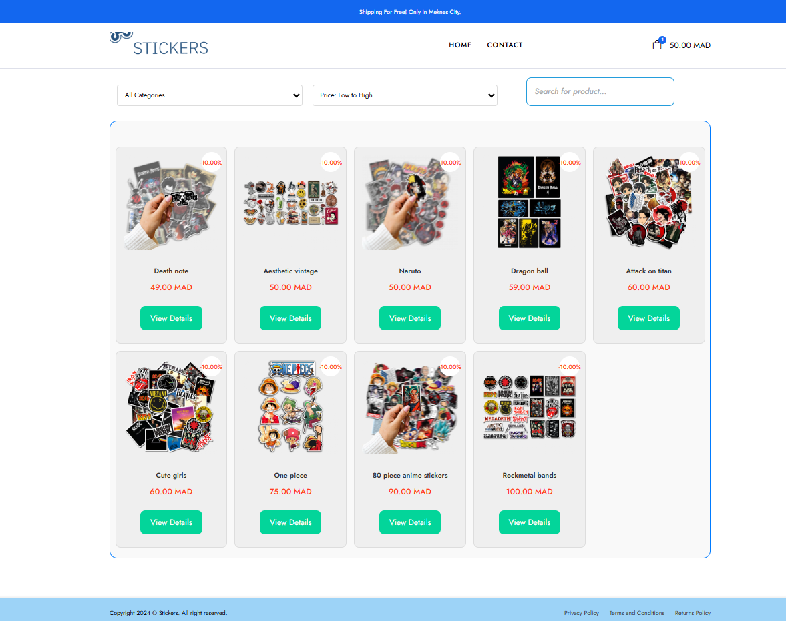
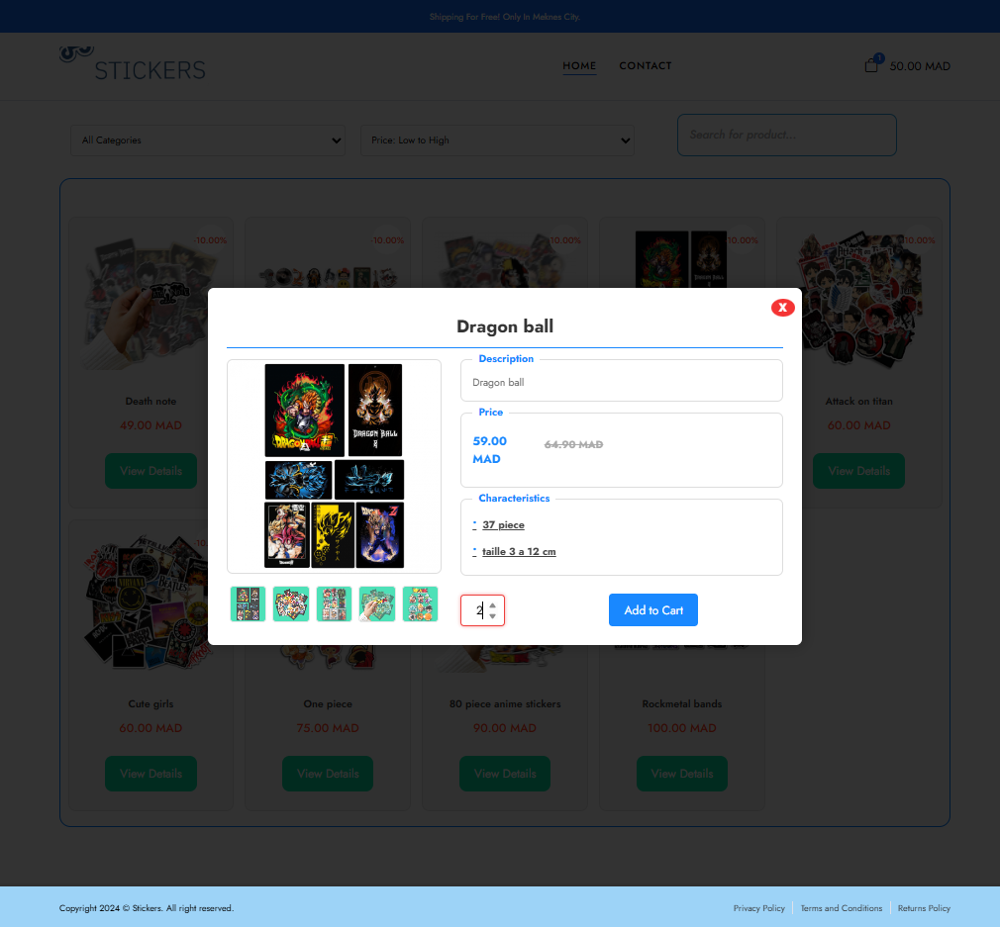
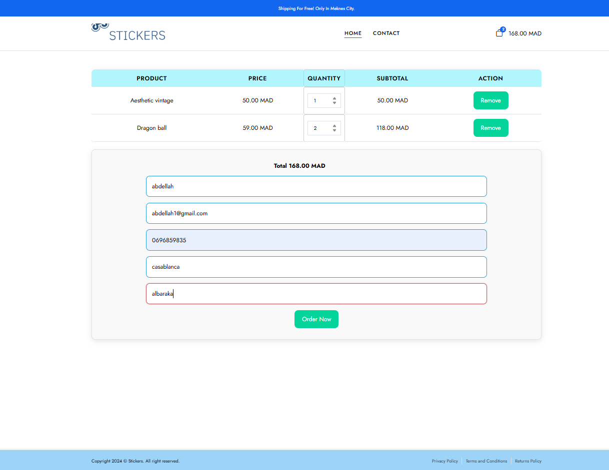
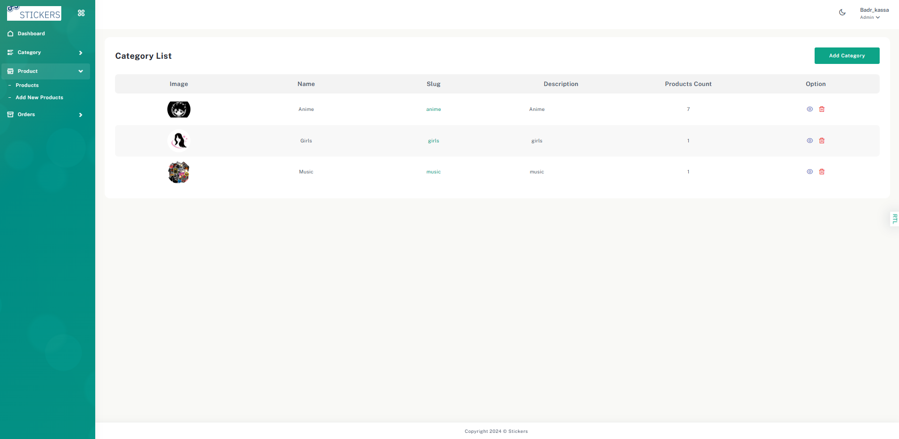
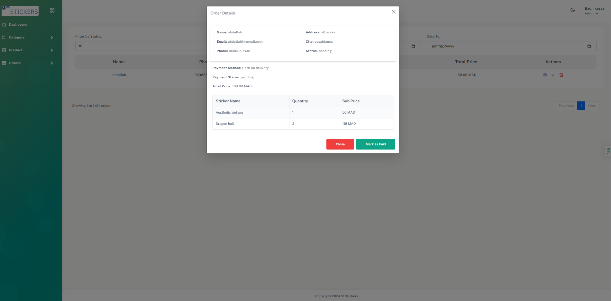

# 🖼️ StickerShop — Laravel E-Commerce Platform

A sleek and minimal sticker e-commerce platform for laptops and devices. Built using **Laravel**, **Livewire**, **Tailwind CSS**, and **Alpine.js** with an admin dashboard for managing categories, products, and customer orders.

---


## 🛠️ Features

- 🛍️ User-facing sticker catalog with filtering and cart functionality
- 🧾 Order placement with phone, address, and payment method fields
- 🔐 Admin login and protected dashboard
- 📂 Category & product management (CRUD with image upload and slugs)
- 📦 Order list view, payment status update, and deletion
- 🛒 Session-based cart system

---

## 🧱 Database Schema

### Users
- `name`, `email`, `password`, `role` (admin/user)

### Categories
- `name`, `slug`, `description`, `image`

### Stickers
- `name`, `slug`, `description`, `category_id`, `image[]`, `caracteristics[]`, `price`, `discount`

### Orders
- `name`, `email`, `phone`, `address`, `city`, `payment_method`, `status`, `payment_status`, `total_price`

### Order Items
- `order_id`, `sticker_id`, `quantity`, `sub_price`

---

## 🚀 Installation (Docker Setup)

### Prerequisites
Make sure you have Docker and Docker Compose installed.

### 1. Clone the Repository

```bash
git clone git@github.com:Abd-Lah/Stickers.git
cd Stickers
docker-compose up -d --build
docker exec -it laravel_app bash
cp .env.example .env
php artisan key:generate
php artisan migrate
php artisan db:seed
php artisan storage:link

npm install
npm run dev
```
then visit http://localhost:8000
for admin http://localhost:8000/admin/login
email: badr@stickers.com
password : badr1997@

## 📸 Screenshots

> _Please upload or update paths to your screenshots in the `/docs/screenshots` folder._

- 
- 
- 
- 
- 
  and more ...
---
